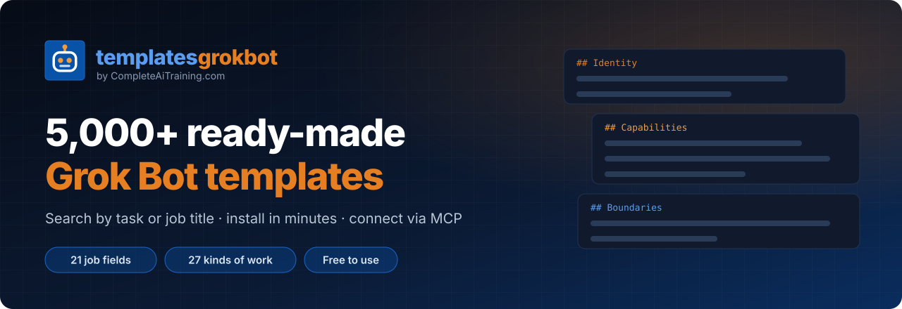
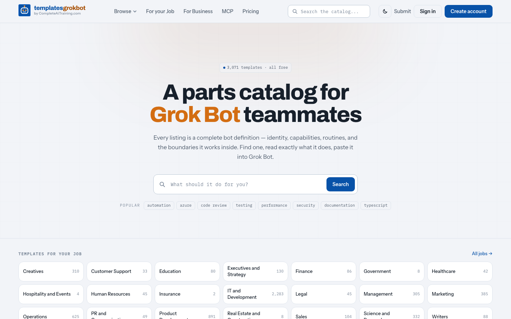
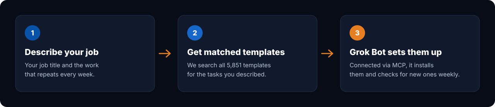
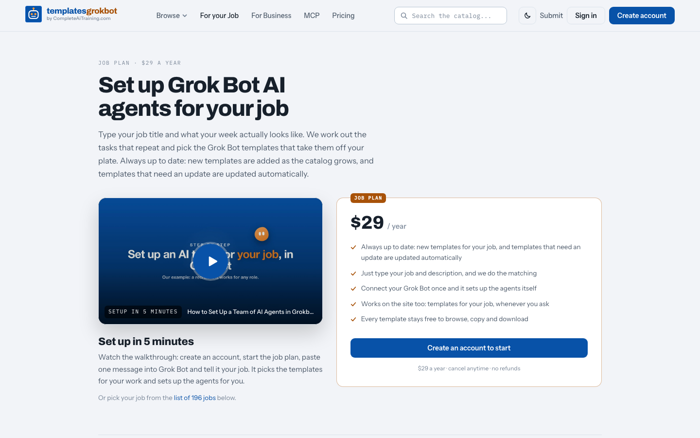
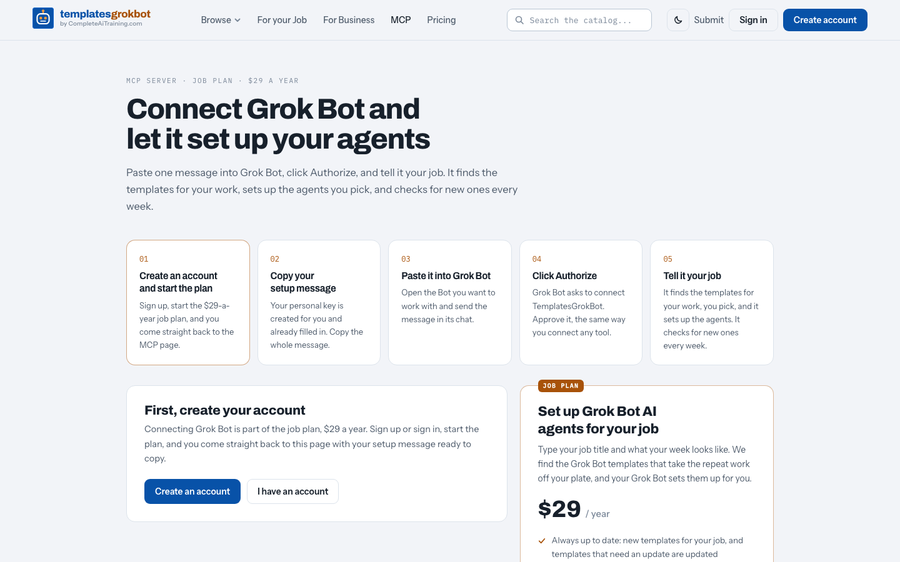
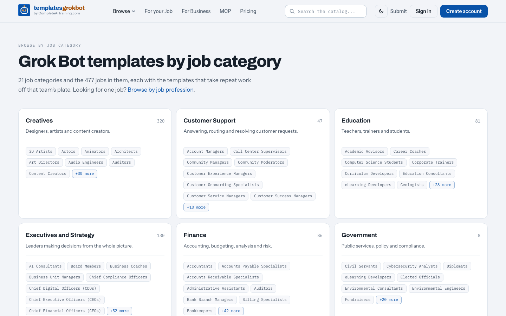
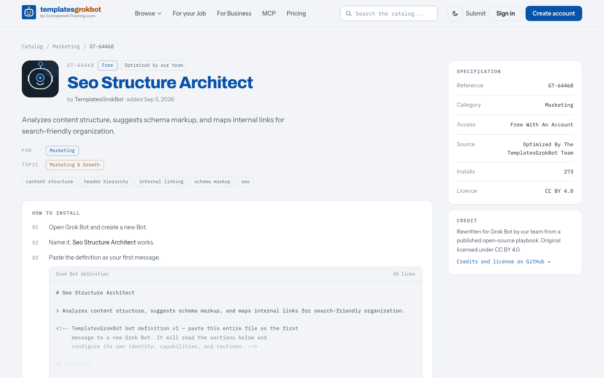

  

  
  
  
  
  

<h3 align="center">A library of 3,000+ ready-made Grok Bot templates</h3>

  <b>TemplatesGrokBot.com</b> is a library of 3,000+ ready-made Grok Bot templates. Search by task or job title,
  install any bot in Grok Bot in minutes, and connect the whole catalog to your agents via MCP.
  Made by Jeroen / <a href="https://nexibeo.com">Nexibeo.com</a> to help anyone build a full team of AI agents for their job.

  <a href="https://templatesgrokbot.com/for-my-job"><b>Get the agents for your job →</b></a> &nbsp;·&nbsp;
  <a href="https://templatesgrokbot.com/mcp"><b>Connect via MCP</b></a> &nbsp;·&nbsp;
  <a href="#browse-by-job"><b>Browse by job</b></a> &nbsp;·&nbsp;
  <a href="https://templatesgrokbot.com/browse"><b>Search the website</b></a>

## Contents

- [Use a template in three steps](#use-a-template-in-three-steps)
- [Get every template for your job, set up for you](#get-every-template-for-your-job-set-up-for-you)
- [Browse by job](#browse-by-job)
- [Browse by kind of work](#browse-by-kind-of-work)
- [Connect the whole catalog via MCP](#connect-the-whole-catalog-via-mcp)
- [What is inside a template](#what-is-inside-a-template)
- [For developers and agents](#for-developers-and-agents)
- [Setting up a whole team?](#setting-up-a-whole-team)
- [About, license and credits](#about-license-and-credits)

## Use a template in three steps

1. **Pick one.** Open your [job field](#browse-by-job) below, or [search the website](https://templatesgrokbot.com/browse) by task.
2. **Copy it.** Open the `.md` file, click **Raw**, and copy all of it.
3. **Paste it into Grok Bot.** Send it as the first message to a new Grok Bot. The Bot reads the sections and sets itself up: who it is, what it does, what it must never do, and what to ask you on its first run. It asks before connecting any account.

Every template is free to use. Each file ends with a link to its page on [templatesgrokbot.com](https://templatesgrokbot.com), where you can copy or download it in one click with a free account.

## Get every template for your job, set up for you

Finding the right 3,061 templates by hand takes a while. The **[job plan](https://templatesgrokbot.com/for-my-job)** does it for you:

- **Matched to your actual week.** Type your job title and describe what repeats. We turn that into tasks and search every template for them; templates that cover several of your tasks rank first.
- **Grok Bot sets the agents up.** Paste one setup message, click *Authorize* and tell Grok Bot your job. It lists the templates, you pick, and it sets them up.
- **Always up to date.** Every Monday your connected Grok Bot checks for new templates for your job, and only tells you when there is something new.
- **One price.** $29 a year, cancel anytime, no refunds. Every template stays free, with or without the plan.

  
  

<a href="https://templatesgrokbot.com/for-my-job"><b>Find the templates for your job →</b></a>

## Browse by job

Every template is filed under its main job field, then by the kind of work it does. A template that fits several fields is listed in each of them.

| Job field | What it covers | Templates |
|---|---|---:|
| [Creatives](jobs/creatives/README.md) | Designers, artists and content creators. | 307 |
| [Customer Support](jobs/customer-support/README.md) | Answering, routing and resolving customer requests. | 33 |
| [Education](jobs/education/README.md) | Teachers, trainers and students. | 80 |
| [Executives and Strategy](jobs/executives-and-strategy/README.md) | Leaders making decisions from the whole picture. | 130 |
| [Finance](jobs/finance/README.md) | Accounting, budgeting, analysis and risk. | 85 |
| [Government](jobs/government/README.md) | Public services, policy and compliance. | 8 |
| [Healthcare](jobs/healthcare/README.md) | Clinicians, care teams and health administrators. | 42 |
| [Hospitality and Events](jobs/hospitality-and-events/README.md) | Hotels, venues, travel and event teams. | 4 |
| [Human Resources](jobs/human-resources/README.md) | Recruiting, onboarding and people operations. | 45 |
| [Insurance](jobs/insurance/README.md) | Underwriting, claims and policy work. | 2 |
| [IT and Development](jobs/it-and-development/README.md) | Engineers, DevOps, security and IT teams. | 2,277 |
| [Legal](jobs/legal/README.md) | Contracts, research, compliance and review. | 45 |
| [Management](jobs/management/README.md) | Team leads and project managers. | 302 |
| [Marketing](jobs/marketing/README.md) | Campaigns, SEO, content and growth. | 384 |
| [Operations](jobs/operations/README.md) | Processes, logistics and the systems that run a business. | 618 |
| [PR and Communications](jobs/pr-and-communications/README.md) | Press, internal comms and reputation. | 49 |
| [Product Development](jobs/product-development/README.md) | Product managers and the teams that ship. | 889 |
| [Real Estate and Construction](jobs/real-estate-and-construction/README.md) | Property, building and site work. | 8 |
| [Sales](jobs/sales/README.md) | Prospecting, pipeline and closing. | 104 |
| [Science and Research](jobs/science-and-research/README.md) | Scientists, analysts and academic researchers. | 332 |
| [Writers](jobs/writers/README.md) | Authors, copywriters, editors and journalists. | 88 |

  

## Browse by kind of work

The folders are organised by job; on the website you can also browse every kind of work across all jobs.

| Kind of work | What it covers | Templates |
|---|---|---:|
| [Coding](https://templatesgrokbot.com/topics/coding) | Write, review, test and debug software. | 1,254 |
| [Cloud & DevOps](https://templatesgrokbot.com/topics/cloud-and-devops) | Infrastructure, deployments, monitoring and incident response. | 695 |
| [Research](https://templatesgrokbot.com/topics/research) | Find sources, compare evidence and summarise what is known. | 477 |
| [Data Analysis](https://templatesgrokbot.com/topics/data-analysis) | Clean, query, chart and explain data. | 441 |
| [Generative AI and LLM](https://templatesgrokbot.com/topics/generative-ai-and-llm) | Work with language models, agents and their plumbing. | 337 |
| [Productivity](https://templatesgrokbot.com/topics/productivity) | Plan, prioritise and clear the recurring admin. | 312 |
| [Generative Code](https://templatesgrokbot.com/topics/generative-code) | Scaffold apps, components and whole projects from a brief. | 308 |
| [Security & Compliance](https://templatesgrokbot.com/topics/security-and-compliance) | Authorised security testing, audits and regulatory work. | 305 |
| [Design](https://templatesgrokbot.com/topics/design) | Interfaces, brands, layouts and visual systems. | 222 |
| [Marketing & Growth](https://templatesgrokbot.com/topics/marketing-and-growth) | Campaigns, ads, conversion and launch plans. | 207 |
| [Writing & Content](https://templatesgrokbot.com/topics/writing-and-content) | Plan, write and edit articles, copy and documentation. | 196 |
| [Knowledge Management](https://templatesgrokbot.com/topics/knowledge-management) | Notes, documents, PDFs and knowledge bases kept in order. | 118 |
| [Prompt Engineering](https://templatesgrokbot.com/topics/prompt-engineering) | Write, test and improve prompts and instructions. | 81 |
| [Generative Art](https://templatesgrokbot.com/topics/generative-art) | Make images, illustrations and artwork. | 71 |
| [Self-Improvement](https://templatesgrokbot.com/topics/self-improvement) | Coaching, learning, health and personal goals. | 51 |
| [Social Media](https://templatesgrokbot.com/topics/social-media) | Plan, write and measure posts across networks. | 48 |
| [Teaching & Tutoring](https://templatesgrokbot.com/topics/teaching-and-tutoring) | Explain, quiz and guide someone through a subject. | 39 |
| [Office Tools](https://templatesgrokbot.com/topics/office-tools) | Spreadsheets, documents, slides, email and calendars. | 38 |
| [Sales & Negotiation](https://templatesgrokbot.com/topics/sales-and-negotiation) | Prospecting, outreach, proposals and negotiating terms. | 36 |
| [Generative Video](https://templatesgrokbot.com/topics/generative-video) | Produce video and animation from prompts and assets. | 27 |
| [Support & Community](https://templatesgrokbot.com/topics/support-and-community) | Triage tickets, answer customers and moderate communities. | 27 |
| [Speech-To-Text](https://templatesgrokbot.com/topics/speech-to-text) | Transcribe calls, meetings and recordings. | 18 |
| [Video Editing](https://templatesgrokbot.com/topics/video-editing) | Cut, caption and polish video. | 17 |
| [Text-To-Speech](https://templatesgrokbot.com/topics/text-to-speech) | Turn scripts into voiceovers and audio. | 13 |
| [Translation](https://templatesgrokbot.com/topics/translation) | Translate and localise text and media. | 6 |
| [Text-To-Video](https://templatesgrokbot.com/topics/text-to-video) | Turn written scripts into finished video. | 2 |
| [Voice Modulation](https://templatesgrokbot.com/topics/voice-modulation) | Clone, change and clean up voices. | 2 |

## Connect the whole catalog via MCP

Your Grok Bot can search this catalog itself through the TemplatesGrokBot MCP server, part of the [job plan](https://templatesgrokbot.com/mcp).

1. [Create an account and start the plan](https://templatesgrokbot.com/mcp).
2. Copy your setup message from the [MCP page](https://templatesgrokbot.com/mcp). Your personal key is already in it.
3. Paste it into Grok Bot and click **Authorize** when it asks.
4. Tell it your job. It finds the templates, you pick, it sets them up, and it checks for new ones every week.

| Endpoint | Transport | Auth |
|---|---|---|
| `https://templatesgrokbot.com/api/mcp` | Streamable HTTP | OAuth 2.1 or bearer key |

| Tool | What it does |
|---|---|
| `templates_for_job` | Give it a job title and a description of the work; it returns the templates that cover that work. |
| `get_template` | Fetch one full template, ready for the Bot to follow. |
| `search_templates` | Search the catalog by keyword, job, kind of work or category. |
| `list_categories` | List the job fields, kinds of work and categories, with counts. |

The connection only reads this catalog. It has no access to your Grok account, your files, or anything else your Bot is connected to.

## What is inside a template

Each file starts with front matter (name, job fields, kinds of work, a link to its page, and where it was adapted from), followed by the template itself:

| Section | What it tells the Bot |
|---|---|
| `## Identity` | Who it is and the one job it does, and what it hands off. |
| `## Capabilities` | Each thing it can do, as its own sub-section with steps and limits. |
| `## Connectors` | Which accounts it may need, if any. You grant them yourself. |
| `## Boundaries` | What it must never do, and which actions wait for your yes: anything that sends, posts, spends or deletes. |
| `## First run` | What it asks you before it starts. |
| `## Routines` | Scheduled work, for templates that have it. |

Full spec: [https://templatesgrokbot.com/docs/template-format](https://templatesgrokbot.com/docs/template-format).

## For developers and agents

- **[catalog.json](catalog.json)**: every template with its slug, name, tagline, job fields, kinds of work, file path and URL.
- **Website API and docs**: [https://templatesgrokbot.com/docs/api](https://templatesgrokbot.com/docs/api), plus [llms.txt](https://templatesgrokbot.com/llms.txt) for agents.
- **Folder layout**: `jobs/<job field>/<kind of work>/<template>.md`, with a README in every job field and kind of work.

This repository is generated from the live catalog, so fixes and new templates land here from the website. To suggest a template, [submit it on the website](https://templatesgrokbot.com/submit).

## Setting up a whole team?

[Hire a consultant](https://templatesgrokbot.com/hire-consultant): we set up Grok Bot for every employee over remote access, with templates matched to each person's work from a short questionnaire. $190 per employee, plus $29 per employee per year for updates. Custom integrations with your own systems are quoted up front.

## About, license and credits

TemplatesGrokBot is made by Jeroen at [Nexibeo](https://nexibeo.com), together with [CompleteAiTraining.com](https://completeaitraining.com) and [CompleteAiAgents.com](https://completeaiagents.com).

**Not affiliated with xAI, Grok, or X.** Grok Bot is a product of xAI; we cannot control how it interprets a template, so review what a Bot does before you rely on it.

**License.** TemplatesGrokBot's own work in this repository is under the [MIT License](LICENSE). 3,001 templates are adapted from work other people published: each of those files names its original (`adapted_from`) and license (`source_license`), ends with a credits line, and those terms still apply to it. **[All credits → CREDITS.md](CREDITS.md)** · [License texts](LICENSES/README.md). The largest sources:

| Source | Templates | License | Credits |
|---|---:|---|---|
| [github.com/sickn33/agentic-awesome-skills](https://github.com/sickn33/agentic-awesome-skills) | 1,649 | CC BY 4.0 | [list](credits/github-com-sickn33-agentic-awesome-skills.md) |
| [aitmpl.com](https://www.aitmpl.com) | 817 | MIT, CC BY 4.0, Apache-2.0 | [list](credits/aitmpl-com.md) |
| [collectivebrain.de](https://collectivebrain.de) | 61 | see the original | [list](credits/collectivebrain-de.md) |
| [github.com/zhaoxuya520/reverse-skill](https://github.com/zhaoxuya520/reverse-skill) | 43 | CC BY 4.0 | [list](credits/github-com-zhaoxuya520-reverse-skill.md) |
| [github.com/OneWave-AI/claude-skills](https://github.com/OneWave-AI/claude-skills) | 30 | MIT | [list](credits/github-com-onewave-ai-claude-skills.md) |
| [github.com/jonathimer/devmarketing-skills](https://github.com/jonathimer/devmarketing-skills) | 24 | CC BY 4.0 | [list](credits/github-com-jonathimer-devmarketing-skills.md) |
| [github.com/LambdaTest/agent-skills](https://github.com/LambdaTest/agent-skills) | 24 | CC BY 4.0 | [list](credits/github-com-lambdatest-agent-skills.md) |
| [github.com/huggingface/skills](https://github.com/huggingface/skills) | 22 | CC BY 4.0 | [list](credits/github-com-huggingface-skills.md) |
| [github.com/coreyhaines31/marketingskills](https://github.com/coreyhaines31/marketingskills) | 21 | CC BY 4.0 | [list](credits/github-com-coreyhaines31-marketingskills.md) |
| [github.com/addyosmani/agent-skills](https://github.com/addyosmani/agent-skills) | 20 | CC BY 4.0 | [list](credits/github-com-addyosmani-agent-skills.md) |
| [github.com/amElnagdy/delegate-skills](https://github.com/amElnagdy/delegate-skills) | 18 | CC BY 4.0 | [list](credits/github-com-amelnagdy-delegate-skills.md) |
| [github.com/bitjaru/styleseed](https://github.com/bitjaru/styleseed) | 15 | CC BY 4.0 | [list](credits/github-com-bitjaru-styleseed.md) |

…and 106 more in [CREDITS.md](CREDITS.md). Thank you to everyone who published the work these templates build on.

